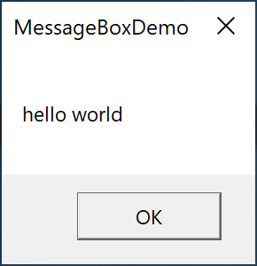
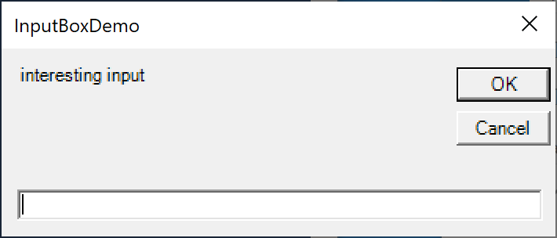
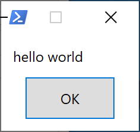
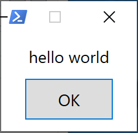
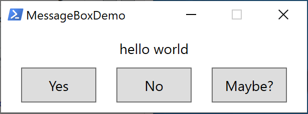
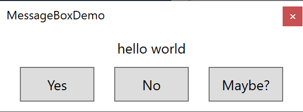
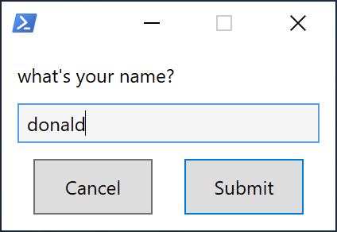
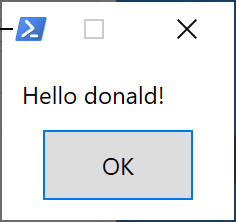

# *Message Box, Input Box*, <u>AnyBox</u>

* [Overview](#overview)
* [How to get it](#how-to-get-it)
* [Message Box](#message-box)
* [Input Box](#input-box)
* [AnyBox](#anybox)
  * [Prompts](#prompts)
  * [Buttons](#buttons)
  * [Data Grid](#data-grid)
  * [Handling Input](#handling-input)
* [More resources](#more-resources)

Read this on [GitHub](https://github.com/dm3ll3n/AnyBox) or [my site](https://www.donaldmellenbruch.com/project/AnyBox/).

## Overview

Creating forms in Powershell can be tedious, from aligning the content
just right to wiring up events. Thankfully, when it comes to GUIs for
Powershell scripts, a simple message box or input box usually does the
trick. The problem is that the not-so-built-in offerings for Powershell
are extremely limited in (1) features and (2) customization.

Message box:

``` powershell
Add-Type -AssemblyName PresentationFramework

[System.Windows.MessageBox]::Show('hello world', 'MessageBoxDemo')
```



Input box:

``` powershell
[Reflection.Assembly]::LoadWithPartialName('Microsoft.VisualBasic')

[Microsoft.VisualBasic.Interaction]::InputBox('interesting input', 'InputBoxDemo')
```



Neither of these approaches are customizable beyond the essentials; they
are focused purely on their limited functional. They’re also not very
Powershell-esque. If you want anything more, you’ll have to create it
yourself. A few options exist to make the creation of a custom form
simpler (form designers), but the learning curve can be steep for a
non-developer Powershell users (e.g., engineers, admins), and it is a
tedious task even for the Powershell experts.

AnyBox was developed to satisfy both the need for simplicity and
advanced customization when creating appealing WPF forms in Windows
Powershell.

## How to get it

Install AnyBox from the [Powershell
Gallery](https://www.powershellgallery.com/packages/AnyBox) with:

``` powershell
Install-Module -Name 'AnyBox'
```

Then, load it with:

``` powershell
Import-Module AnyBox
```

## Message Box

Simple message box with AnyBox:

``` powershell
Show-AnyBox -Title 'MessageBoxDemo' -Message 'hello world' -Buttons 'OK'
```



Center the content and increase font size:

``` powershell
Show-AnyBox -Title 'MessageBoxDemo' -Message 'hello world' -FontSize 14 -ContentAlignment 'Center' -Buttons 'OK'
```



Add more buttons:

``` powershell
Show-AnyBox -Title 'MessageBoxDemo' -Message 'hello world' -FontSize 14 -ContentAlignment 'Center' -Buttons 'Yes','No','Maybe?'
```



Change the modal frame and set the window topmost:

``` powershell
Show-AnyBox -Title 'MessageBoxDemo' -Message 'hello world' -FontSize 14 -ContentAlignment 'Center' -Buttons 'Yes','No','Maybe?' -WindowStyle 'ToolWindow' -Topmost
```



Make it gnarly:

``` powershell
Show-AnyBox -Title 'MessageBoxDemo' -Message 'hello world' -FontSize 14 -ContentAlignment 'Center' -Buttons 'Yes','No','Maybe?' -Topmost `
    -Icon 'Warning' -BackgroundColor 'Black' -FontColor 'Orange' -FontFamily 'Comic Sans MS'
```


## Input Box

Simple input box with AnyBox:

``` powershell
Show-AnyBox -Title 'InputBoxDemo' -Prompt "what's your name?" -Buttons 'Cancel','Submit'
```


Add more prompts and a comment:

``` powershell
Show-AnyBox -Title 'InputBoxDemo' -Prompts "what's your name?","what's your number?" -Buttons 'Cancel','Submit' -Comment '* responses are confidential'
```


> The next couple of examples jump ahead a bit, but to give you an idea
> of what’s possible…

Multi-line input:

``` powershell
Show-AnyBox -Title 'InputBoxDemo' -Buttons 'Cancel','Submit' -Prompts @(
    New-AnyBoxPrompt -Message 'Query:' -LineHeight 5
)
```


Grouped prompts and collapsible prompts:

``` powershell
Show-AnyBox -Title 'InputBoxDemo' -Buttons 'Cancel','Submit' -MinWidth 100 -Prompts @(
    New-AnyBoxPrompt -Group 'Connection Info' -Message 'SQL Instance:'
    New-AnyBoxPrompt -Group 'Connection Info' -Message 'User Name:'
    New-AnyBoxPrompt -Group 'Connection Info' -Message 'Password:' -InputType Password
    New-AnyBoxPrompt -Group 'Query' -LineHeight 5 -Collapsible
)
```


## AnyBox

AnyBox makes a fine replacement for your typical message box and input
box, and it can do a lot more. So much so that, given a long list of
parameters, it may be more intuitive to “build” the AnyBox top-down
rather than calling the function with a long list of parameters. For
example, the two functions below produce the same AnyBox:

``` powershell
Show-AnyBox -Icon 'Question' -Title 'AnyBoxDemo' -Prompts "what's your name?","what's your number?" -FontSize 14 -ContentAlignment 'Center' -Buttons 'Yes','No','Maybe?' -DefaultButton 'Yes' -CancelButton 'No' -ButtonRows 2 -Topmost
```

*or*

``` powershell
Import-Module AnyBox

$anybox = New-Object AnyBox.AnyBox

$anybox.Icon = 'Question'
$anybox.Title = 'AnyBoxDemo'
$anybox.Prompts = 'what''s your name?','what''s your number?'
$anybox.FontSize = 14
$anybox.ContentAlignment = 'Center'
$anybox.Buttons = 'Yes','No','Maybe?'
$anybox.DefaultButton = 'Yes'
$anybox.CancelButton = 'No'
$anybox.ButtonRows = 2
$anybox.Topmost = $true

$anybox | Show-AnyBox
```


> Note: the later syntax was introduced in AnyBox v0.3.4.

### Prompts

AnyBox offers many different prompt types. The typical prompt `Text`,
shown in the examples above, is used when the value for “-Prompts” is a
string. As you’ll see, `Text` can be represented as a text box, combo
box, or set of radio buttons. To use other prompt types and make
customizations to individual prompts, use `New-AnyBoxPrompt`.

``` powershell
Import-Module AnyBox

$anybox = New-Object AnyBox.AnyBox

$anybox.Prompts = @(
  # typical text prompt, but with default value.
  New-AnyBoxPrompt -InputType Text -Message "what's your name?" -DefaultValue 'donald'
  # typical text prompt, but with validation (must be all numeric).
  New-AnyBoxPrompt -InputType Text -Message "what's your number?" -ValidateScript { $_ -match '^[0-9]+$' }
  # sets are shown as drop-down lists.
  New-AnyBoxPrompt -InputType Text -Message "what's your favorite color?" -ValidateSet 'red','blue','green' -DefaultValue 'blue'
  # or sets of radio buttons.
  New-AnyBoxPrompt -InputType Text -Message "what's your favorite fruit?" -ValidateSet 'apple','banana','tomato?' -DefaultValue 'banana' -ShowSetAs Radio
  # date input.
  New-AnyBoxPrompt -InputType Date -Message "what's your birthday?" -DefaultValue '1970-01-01'
  # secure string input.
  New-AnyBoxPrompt -InputType Password -Message "what's your SSN?"
  # file input
  New-AnyBoxPrompt -InputType FileOpen -Message "Upload supporting documents:"
  # link input
  New-AnyBoxPrompt -InputType Link -Message "Terms & Conditions" -DefaultValue 'www.donaldmellenbruch.com'
  # checkbox (boolean) input.
  New-AnyBoxPrompt -InputType Checkbox -Message "I have read the terms & conditions" -DefaultValue $false
)

$anybox.ContentAlignment = 'Center'
$anybox.Buttons = 'Cancel','Submit'
$anybox.Icon = 'Question'

$anybox | Show-AnyBox
```


### Buttons

To create a customized button, use `New-AnyBoxButton`. There are a few
pre-made action buttons that can be created from a template, such as
`'CopyMessage'`, which will copy the displayed message to the clipboard.

``` powershell
Import-Module AnyBox

$anybox = New-Object AnyBox.AnyBox

$anybox.Icon = 'Error'
$anybox.Message = 'Process.exe exited with code -1.'

$anybox.Buttons = @(
  New-AnyBoxButton -Text 'Close' -IsCancel
  New-AnyBoxButton -Template 'CopyMessage'
  New-AnyBoxButton -Text 'Retry' -IsDefault
)

$anybox | Show-AnyBox
```


### Data Grid

In addition to messages, prompts, and buttons, AnyBox can present a data
grid, complete with a search bar.

``` powershell
Import-Module AnyBox

$anybox = New-Object AnyBox.AnyBox

$anybox.Title = 'Windows Services'
$anybox.ContentAlignment = 'Center'
$anybox.MaxHeight = 600

$anybox.GridData = Get-Service | Select-Object Status, Name, DisplayName

$anybox.Buttons = @(
  New-AnyBoxButton -Text 'Close'
  New-AnyBoxButton -Template 'ExploreGrid'
  New-AnyBoxButton -Template 'SaveGrid'
)

$anybox | Show-AnyBox
```


> Suppress the grid search bar by setting `$anybox.NoGridSearch=$true`

### Handling Input

Getting a message to users is only half the battle. Handling their
responses is the other half, and AnyBox makes that easier too.

After an AnyBox window closes, it returns a hashtable of user inputs (if
any). The hashtable will contain a key for each prompt and each button.
By default, prompt keys are named “Input\_\#”, where `#` is index of the
prompt in the order they were defined (starting from 0). Buttons, by
default, are named by their text. To override the corresponding key
name, specify a `-Name` for the prompt/button when defining it with
`New-AnyBoxPrompt`/`New-AnyBoxButton`. Names cannot contain spaces.

``` powershell
Import-Module AnyBox

$anybox = New-Object AnyBox.AnyBox

$anybox.Prompts = 1..3 | ForEach-Object { New-AnyBoxPrompt -Message "Prompt $_" -Name "Prompt_$_" }
$anybox.Buttons = 1..3 | ForEach-Object { New-AnyBoxButton -Text "Button $_" -Name "Button_$_" }

$response = $anybox | Show-AnyBox

$response
```


    ## 
    ## Name                           Value                                                                                   
    ## ----                           -----                                                                                   
    ## Prompt_3                       also, text                                                                              
    ## Button_1                       False                                                                                   
    ## Prompt_2                       moar text                                                                               
    ## Prompt_1                       some text                                                                               
    ## Button_3                       True                                                                                    
    ## Button_2                       False

To examine the output for a specific prompt/button (here, `Prompt_1`):

``` powershell
$response['Prompt_1']
```

To see which button was clicked, iterate over the hashtable.

``` powershell
$response.Keys | Where-Object { $_ -like 'Button_*' -and $response[$_] -eq $true }
```

A similar method of iterating over the responses, which will return an
array of key-value pairs that match a condition.

``` powershell
$response.GetEnumerator() | Where-Object { $_.Name -like 'Prompt_*' -and $_.Value -like '*' }
```

So, a simple AnyBox workflow could look something like:

``` powershell
Import-Module AnyBox

# build the AnyBox
$anybox = New-Object AnyBox.AnyBox

$anybox.Prompts = New-AnyBoxPrompt -Name 'name' -Message "what's your name?" -ValidateNotEmpty

$anybox.Buttons = @(
    New-AnyBoxButton -Name 'cancel' -Text 'Cancel' -IsCancel
    New-AnyBoxButton -Name 'submit' -Text 'Submit' -IsDefault
)

# show the AnyBox; collect responses.
$response = $anybox | Show-AnyBox

# act on responses.
if ($response['submit'] -eq $true) {
    $name = $response['name']
    Show-AnyBox -Message "Hello $name!" -Buttons 'OK'
}
else {
    Show-AnyBox -Message "Ouch!" -Buttons 'OK'
}
```

 —–&gt; 

## More resources

This guide was reworked as of AnyBox v0.3.4. More extensive docs exist
at:

<a href="https://www.donaldmellenbruch.com/doc/anybox/" class="uri">https://www.donaldmellenbruch.com/doc/anybox/</a>

Cheers!
